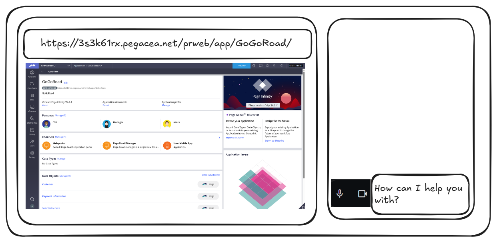

# GuideMeApp - Video Conferencing Application

This project is a React-based video conferencing application, designed to provide a simple and efficient way for users to communicate via video, audio, and text chat.

The objective is to ultimately build it into an AI Tutor by integrating it with Gemini 2.0 real-time multimodal interactions (akin to Gemini Stream Realtime feature) to interactively guide learners through Pega Academy challenges

## App's wireframe



## Project Structure

The project is organized into the following directory structure:

```
src/
├── Components/
│ ├── GuideMe/
│ │ └── index.js # Main component of the application
│ ├── ChatWindow.js # Component for handling text chat functionality
│ ├── MediaControls.js # Component for managing audio, video, and screen sharing controls
│ └── SharedScreenDisplay.js # Component for displaying shared screen content
├── index.js # Entry point of the React application
```

## Component Overview

- **`GuideMe/index.js`**:
  - This is the main component of the application. It orchestrates the other components to create the video conferencing interface.
  - It manages the state for messages, media controls, and screen sharing.
  - It uses the other components (`ChatWindow`, `MediaControls`, `SharedScreenDisplay`) to render the UI.
- **`ChatWindow.js`**:
  - Handles the display of chat messages and the input for sending new messages.
  - Uses React Bootstrap components for styling and form handling.
  - Implements smooth scrolling to the bottom of the chat window when new messages are added.
  - Uses Framer Motion for message animations.
- **`MediaControls.js`**:
  - Provides controls for toggling microphone and video, and for starting/stopping screen sharing.
  - Uses React Bootstrap buttons and Lucide icons for the UI.
  - Manages the state for mute/unmute and screen sharing.
- **`SharedScreenDisplay.js`**:
  - Displays the shared screen content or a placeholder message when screen sharing is not active.
  - Uses a `<video>` element to display the screen stream.
  - Uses the Web API `navigator.mediaDevices.getDisplayMedia` to capture the screen.

## Dependencies

- **React**: Core library for building the UI.
- **React Bootstrap**: UI component library for styling and layout.
- **Lucide React**: Icon library.
- **Framer Motion**: Animation library.

## Setup and Installation

1.  **Clone the repository:**

    ```bash
    git clone <repository-url>
    cd <project-directory>
    ```

2.  **Install dependencies:**

    ```bash
    npm install
    ```

3.  **Start the development server:**

    ```bash
    npm start
    ```

    This will start the application in development mode. Open your browser and navigate to `http://localhost:3000` to view the app.

## Contributing

If you'd like to contribute to this project, please follow these guidelines:

- **Modular Architecture:**
  - Maintain the existing modular architecture. Each component should have a single responsibility.
  - New features should be implemented as separate components whenever possible.
  - Components should communicate with each other through props and events.
  - Avoid tightly coupled code and promote reusability.
- **Coding Style:**
  - Follow the established coding style for React and JavaScript.
  - Use consistent indentation (2 spaces).
  - Use meaningful variable and function names.
  - Write clear and concise comments to explain complex logic.
  - Organize imports in a consistent manner.
  - Use functional components and hooks whenever possible.
  - Keep components small and focused.
  - Adhere to the React component lifecycle best practices.
- **Version Control:**
  - Create a new branch for each feature or bug fix.
  - Write clear and concise commit messages.
  - Ensure your code is well-documented and follows the project's coding style.
  - Submit a pull request with a detailed description of your changes.

## Future Improvements

This section outlines the planned future improvements for the GuideMeApp, categorized by Minimum Lovable Product (MLP) milestones.

### MLP1: Screenshot-Based Interaction

- **Screenshot Capture:** Implement functionality to capture screenshots of the user's Pega Platform instance using `html2canvas`.
- **Challenge URL Input:** Allow users to input the Pega Academy challenge URL for contextual guidance.
- **API Integration:** Integrate with the Gemini API to send screenshots, challenge URLs, and user messages.
- **Display Gemini's Response:** Display Gemini's responses in the chat window.
- **Backend API (`/api/gemini`)**: Create a backend API to handle communication with the Gemini API.

* **User Story 1: Capture and Send Screenshot**
  - As a learner, I want to be able to capture a screenshot of my Pega Platform instance so that I can share it with the AI tutor for assistance.
  - Acceptance Criteria:
    - The application provides a button or command to capture a screenshot of the specified area.
    - The captured screenshot is converted into a base64 encoded image.
    - The screenshot is sent to the backend API along with my message and the challenge URL.
* **User Story 2: Input Challenge URL**
  - As a learner, I want to be able to input the URL of the Pega Academy challenge I am working on so that the AI tutor can provide contextually relevant assistance.
  - Acceptance Criteria:
    - The chat interface includes an input field for the challenge URL.
    - The application validates the URL format.
    - The application sends the URL to the backend API.
* **User Story 3: Receive AI Tutor Response**
  - As a learner, I want to receive responses from the AI tutor in the chat interface so that I can get guidance on my Pega Academy challenge.
  - Acceptance Criteria:
    - The application displays the AI tutor's responses in the chat window.
    - The responses are clearly distinguished from my own messages.
* **User Story 4: Backend API Integration**
  - As a developer, I want to create a backend API that will receive the screenshot, challenge URL, and user message, and then send that information to the Gemini API.
  - Acceptance Criteria:
    - The backend API receives the screenshot, challenge URL, and user message from the front end.
    - The backend API sends the data to the Gemini API.
    - The backend API sends the Gemini API response back to the front end.

### MLP2: WebRTC Integration

- **WebRTC Server Setup:** Implement a signaling server and establish WebRTC connections for real-time screen sharing.
- **WebRTC Stream Optimization:** Optimize the screen sharing stream for real-time performance.
- **Robust Error Handling:** Implement error handling for WebRTC connection issues.

* **User Story 5: Real-Time Screen Sharing via WebRTC**
  - As a learner, I want to share my Pega Platform instance in real-time with the AI tutor so that I can receive up-to-date guidance.
  - Acceptance Criteria:
    - The application establishes a WebRTC connection for screen sharing.
    - The screen sharing stream is displayed to the AI tutor with minimal latency.
    - The screen sharing stream is secure.
* **User Story 6: Optimize WebRTC Stream**
  - As a developer, I want to optimize the WebRTC stream for real-time performance so that the AI tutor receives smooth and responsive video.
  - Acceptance Criteria:
    - The application adjusts the stream's resolution and frame rate based on network conditions.
    - The stream is encoded efficiently to minimize bandwidth usage.
* **User Story 7: Handle WebRTC Connection Issues**
  - As a developer, I want to implement robust error handling for WebRTC connection issues so that the screen sharing remains stable.
  - Acceptance Criteria:
    - The application detects and handles connection failures.
    - The application provides informative error messages to the learner.
    - The application attempts to automatically reconnect when possible.

### MLP3: Real-Time Multimodal Interaction

- **Gemini 2.0 Real-Time Integration:** Integrate with Gemini 2.0's real-time multimodal interaction capabilities.
- **Real-Time Feedback and Guidance:** Enable Gemini 2.0 to provide real-time feedback and guidance based on the screen sharing stream.
- **Interactive User Interface:** Design an intuitive UI for displaying Gemini 2.0's feedback and allowing user interaction.
- **Pega Academy Challenge Context:** Provide Gemini 2.0 with the Acceptance Criteria for active challenges.
- **Voice and Text Interaction:** Implement mechanisms for the learner to interact with Gemini 2.0 using voice commands and text input.

* **User Story 8: Real-Time AI Tutor Feedback**
  - As a learner, I want to receive real-time feedback from the AI tutor based on my actions in the Pega Platform instance so that I can correct my mistakes immediately.
  - Acceptance Criteria:
    - The AI tutor analyzes the screen sharing stream and my interactions.
    - The AI tutor provides feedback in the chat interface in real time.
* **User Story 9: Interactive UI for AI Tutor Feedback**
  - As a developer, I want to design an intuitive UI for displaying the AI tutor's feedback so that the learner can easily understand and act on it.
  - Acceptance Criteria:
    - The UI displays the AI tutor's feedback clearly and concisely.
    - The UI allows the learner to interact with the AI tutor (e.g., ask follow-up questions).
* **User Story 10: Voice Interaction with AI Tutor**
  - As a learner, I want to be able to interact with the AI tutor using voice commands so that I can get assistance without typing.
  - Acceptance Criteria:
    - The application supports voice input for communicating with the AI tutor.
    - The AI tutor's responses are also delivered via voice output.
* **User Story 11: Provide Pega Documentation Context**
  - As a developer, I want to provide the AI tutor with relevant Pega documentation snippets so that it can provide more accurate and comprehensive assistance.
  - Acceptance Criteria:
    - The backend API retrieves relevant Pega documentation snippets based on the active challenge and user query.
    - The documentation snippets are included as context in the Gemini API request.
    - The AI tutor's feedback incorporates information from the provided documentation.

### Ongoing Improvements

- **User Authentication:** Implement user authentication for secure access.
- **Usability Testing:** Conduct usability testing with learners to improve the user experience.
- **Automated Testing:** Implement automated tests to ensure application reliability.
- **Performance Monitoring:** Continuously monitor and optimize application performance.
- **Instructor Feedback:** Gather feedback from Pega Academy Curriculum Developers to refine the application.

## Notes

- This application uses `crypto.randomUUID()` for generating unique message IDs.
- The screen sharing functionality relies on the browser's `navigator.mediaDevices.getDisplayMedia()` API.
- The application uses React Bootstrap for styling, so familiarity with Bootstrap classes is helpful.

Feel free to reach out if you have any questions or suggestions!

## Team

- Praveen
- Naveen
- Asha
- Nelly
